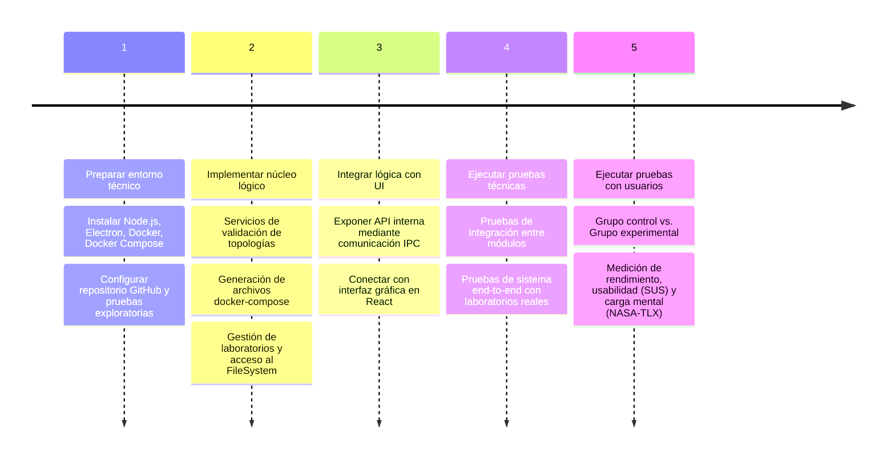

# VDocker - Editor visual de topologías Docker

[](https://github.com/bastian176x/VDocker/actions/workflows/ci.yml)

> 

VDocker es una aplicación de escritorio diseñada para construir, gestionar y desplegar laboratorios basados en contenedores Docker a través de una interfaz visual intuitiva (Drag & Drop).

## Problema y solución

La creación de entornos de práctica con Docker suele implicar la edición manual de archivos `docker-compose.yml`, la gestión de redes, puertos y volúmenes, y el uso intensivo de la línea de comandos. Esto puede resultar propenso a errores de sintaxis, configuraciones inconsistentes y dificultades para visualizar la topología completa del sistema.

**VDocker aborda este problema** proporcionando una interfaz visual que permite definir servicios, redes y relaciones entre contenedores mediante un editor Drag & Drop. A partir de esta representación gráfica, la aplicación genera automáticamente la configuración equivalente en Docker Compose y gestiona el ciclo de vida de los contenedores (creación, ejecución y eliminación).

De esta forma, los usuarios pueden centrarse en el diseño y comportamiento del entorno, sin preocuparse por los detalles de implementación en YAML o comandos de Docker.

## Características principales

- **Editor visual Drag & Drop:** Diseña topologías de red y servicios sin escribir una sola línea de código YAML.
- **Catálogo de servicios integrado:** Nodos preconfigurados para bases de datos, servidores web, clientes y servicios vulnerables para laboratorios de ciberseguridad.
- **Despliegue con 1 clic:** Inicia, detén y limpia laboratorios completos directamente desde la interfaz.
- **Terminal embebida:** Interactúa con tus contenedores sin salir de la aplicación.
- **Plantillas reutilizables:** Guarda tus escenarios como archivos `.vdlab` para compartirlos o reutilizarlos en futuras clases.
- **Validación inteligente:** Detección de conflictos de puertos y errores de topología antes del despliegue.


## Descarga rápida (recomendado)

Si deseas probar VDocker sin tener que compilar el código fuente, puedes descargar el instalador oficial (`.exe` para Windows) directamente desde nuestras *Releases*:

1. Ve a la página de **[Releases](https://github.com/bastian176x/VDocker/releases/latest)** de este repositorio.
2. Busca la versión más reciente (ej. `v1.0.0`).
3. Desplázate hasta el final de las notas de esa versión, a la sección **Assets**.
4. Haz clic en el archivo ejecutable (ej. `VDocker-Setup.exe`) para descargarlo e instalarlo en tu equipo.

---

## Stack tecnológico

VDocker está construido con estándares modernos de la industria para garantizar rendimiento, mantenibilidad y escalabilidad:

- **Frontend:** React, Vite
- **Desktop/Backend:** Electron, Node.js, Dockerode
- **Testing:** Jest (Suite completa de pruebas unitarias, de integración y de sistema)
- **CI/CD:** GitHub Actions (Validación y compilación automatizada de instaladores)

---

## Metodología de desarrollo

El desarrollo de VDocker sigue una estrategia de implementación estructurada en cinco fases principales para garantizar la calidad del software y su validación pedagógica (actuamente en etapa 5):



## Requisitos previos (Para desarrolladores)

Si deseas clonar y modificar el proyecto, asegúrate de tener instalado:

- [Node.js](https://nodejs.org/) (versión recomendada: 18 o superior)
- [npm](https://www.npmjs.com/) (normalmente viene con Node.js)
- Git
- Docker Desktop (en ejecución)

## Instalación

1. **Clonar el repositorio:**

```bash
git clone https://github.com/bastian176x/VDocker.git
cd VDocker
```

1. **Instalar dependencias del proyecto raíz (Electron):**

```bash
npm install
```

1. **Instalar dependencias del frontend (React/Vite):**

```bash
cd frontend
npm install
cd ..
```

> [!NOTE]
> Es importante realizar la instalación en ambas carpetas (/ y /frontend) para que todos los comandos funcionen correctamente.

## Desarrollo

Para iniciar la aplicación en modo desarrollo (con recarga en caliente tanto para el frontend como para Electron):

```bash
npm run dev
```

Este comando ejecutará concurrentemente:

- Servidor de desarrollo de Vite (Frontend)
- Ventana de Electron

## Pruebas (Testing automatizado)

El proyecto cuenta con una suite +20 tests automatizados, que incluyen pruebas unitarias, de integración y de sistema implementadas con **Jest** para garantizar la integridad de la generación de topologías, el manejo del sistema de archivos y la interacción con el motor de Docker.

Para ejecutar la batería de pruebas localmente y generar el reporte de métricas de cobertura:

```bash
npm test -- --coverage
```

## Construcción (Build manual)

Para empaquetar la aplicación para distribución en tu máquina local:

```bash
npm run build
```

Este proceso:

1. Compilará el frontend de React.
2. Empaquetará la aplicación Electron utilizando `electron-builder`.

Los archivos generados se encontrarán en la carpeta `dist/`.

## Estructura del proyecto

- `app/` - Código principal del proceso de Electron (`main.js`, preload scripts, etc.).
- `frontend/` - Código fuente de la interfaz de usuario (React, componentes, estilos).
- `dist/` - Carpeta generada con los ejecutables compilados (ignorada en git).
- `scripts/` - Scripts de utilidad para el desarrollo/build.
- `__tests__/` - Suite de pruebas unitarias, de integración y sistema (Jest).
- `.github/workflows/` - Configuración del pipeline de Integración y Despliegue Continuo (CI/CD).

## Licencia

> [!NOTE]
> Este proyecto está bajo la Licencia MIT - mira el archivo [LICENSE](LICENSE) para más detalles.
